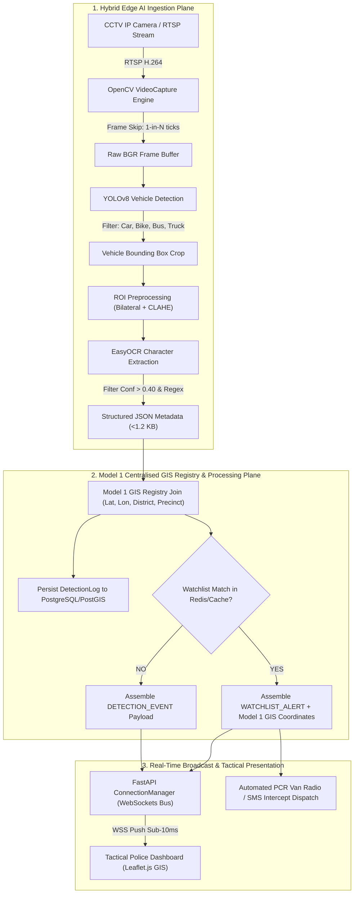
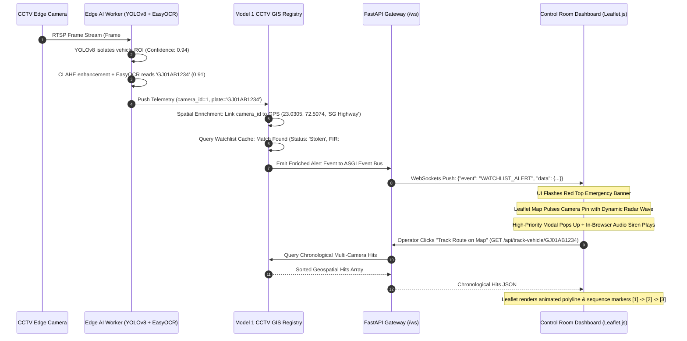

# Gujarat Police Surveillance & Command Network (NETRANG C4I)
## Enterprise High-Level Design (HLD) Document
**Document Reference:** GJP-C4I-HLD-2026-V1  
**Classification:** RESTRICTED — LAW ENFORCEMENT SENSITIVE  
**Target Organization:** Gujarat Police Department, Home Department, Government of Gujarat  
**Author:** Lead Enterprise Systems Architect  
**Status:** Approved for Statewide Scale Architecture  

---

## Table of Contents
1. [Executive Summary](#1-executive-summary)
   - 1.1 [Objectives](#11-objectives)
   - 1.2 [Core Capabilities](#12-core-capabilities)
   - 1.3 [Public Safety Impact](#13-public-safety-impact)
   - 1.4 [Alignment with Gujarat Police Hackathon Architectural Delivery Models](#14-alignment-with-gujarat-police-hackathon-architectural-delivery-models)
2. [System Architecture Blueprint](#2-system-architecture-blueprint)
   - 2.1 [Architectural Delivery Model Mapping: Hybrid / Innovative Architecture with Model 1 Foundation](#21-architectural-delivery-model-mapping-hybrid--innovative-architecture-with-model-1-foundation)
   - 2.2 [Macro Architectural Layers & Multi-Plane Decoupling](#22-macro-architectural-layers--multi-plane-decoupling)
   - 2.3 [Edge AI Engine to Model 1 GIS Registry & WebSockets Ingestion Flow](#23-edge-ai-engine-to-model-1-gis-registry--websockets-ingestion-flow)
   - 2.4 [End-to-End Pipeline Data Flow](#24-end-to-end-pipeline-data-flow)
   - 2.5 [High-Priority Watchlist Interception Sequence](#25-high-priority-watchlist-interception-sequence)
3. [Technology Stack Rationale & Benchmarks](#3-technology-stack-rationale--benchmarks)
4. [80,000-Camera Statewide Scalability Plan](#4-80000-camera-statewide-scalability-plan)
   - 4.1 [3-Tier Distributed Infrastructure Topology](#41-3-tier-distributed-infrastructure-topology)
   - 4.2 [Bandwidth Optimization & Edge Compute Engineering](#42-bandwidth-optimization--edge-compute-engineering)
   - 4.3 [Hierarchical Storage Lifecycle & Retention Strategy](#43-hierarchical-storage-lifecycle--retention-strategy)
5. [Zero-Trust Cybersecurity, Hardening & Compliance](#5-zero-trust-cybersecurity-hardening--compliance)
   - 5.1 [Zero-Trust Identity & Access Management (IAM / RBAC)](#51-zero-trust-identity--access-management-iam--rbac)
   - 5.2 [Data Protection & Cryptographic Standards](#52-data-protection--cryptographic-standards)
   - 5.3 [Immutable Audit Logging & Chain of Custody](#53-immutable-audit-logging--chain-of-custody)
   - 5.4 [Privacy Safeguards & DPDP Act Compliance](#54-privacy-safeguards--dpdp-act-compliance)
6. [Disaster Recovery & High Availability (HA)](#6-disaster-recovery--high-availability-ha)
7. [Appendix: Acronyms & References](#7-appendix-acronyms--references)

---

## 1. Executive Summary

### 1.1 Objectives
The **Gujarat Police Surveillance & Command Network (NETRANG C4I)** is an enterprise-scale, mission-critical computer vision and intelligence grid designed to unify real-time CCTV video surveillance across all 33 districts and 4 commissionerates of Gujarat. The core mission is to automate vehicle tracking, identify stolen/wanted vehicles within sub-second latencies, generate actionable multi-camera forensic trajectories, and provide field officers with real-time situational awareness.

### 1.2 Core Capabilities
- **High-Throughput Edge AI Ingestion**: Continuous vehicle localization, plate region-of-interest (ROI) segmentation, and optical character recognition (OCR).
- **Sub-Second Watchlist Interception**: Cross-referencing against national and state blacklists (e.g., CCTNS, VAHAN, Crime Branch Wanted Database) within $<300\text{ ms}$ of frame capture.
- **GIS Multi-Camera Route Reconstruction**: Chronological spatial reconstruction and movement vector plotting on interactive tactical geographic information systems (GIS).
- **Resilient Operational Resilience**: Edge survival mode capable of continuous local plate logging and alert dispatching during wide-area network (WAN) partition events.

### 1.3 Public Safety Impact
- **Vehicle Theft Interdiction**: Real-time interception alerts dispatched to nearest PCR vans and Highway Patrol units.
- **Anti-Smuggling & Counter-Terrorism Operations**: Automated containment grids around key corridors (Golden Corridor NH-48, Coastal Saurashtra highway networks, and state border checkposts).
- **Evidence Integrity**: Tamper-proof, cryptographically signed vehicle detection logs accepted under Section 65B of the Indian Evidence Act.

### 1.4 Alignment with Gujarat Police Hackathon Architectural Delivery Models

The Gujarat Police Hackathon defines specific architectural delivery models for scaling statewide CCTV infrastructure. The **Gujarat Police Surveillance & Command Network (NETRANG C4I)** officially adopts and implements the **Hybrid / Innovative Architecture**, deliberately utilizing **Model 1 (Centralised CCTV Registry & GIS Mapping Model)** as its foundational asset and metadata layer:

1. **Foundational Asset & Metadata Backbone — Model 1**: Model 1 (Centralised CCTV Registry & GIS Mapping Model) serves as the centralized master spatial database and single source of truth (SSOT). Every CCTV asset across Gujarat's 33 districts, 4 commissionerates, talukas, and highway checkposts is registered centrally with precise geospatial coordinates (WGS-84 latitude/longitude), physical location names, jurisdiction precincts, RTSP stream URLs, and operational status.
2. **Operational Reality of the Hybrid / Innovative Architecture**: Pure centralized video management (Model 2) would saturate Gujarat State Wide Area Network (GSWAN) links by requiring $>320\text{ Gbps}$ of raw video backhaul, while completely decentralized edge silos (Model 3) lack cross-jurisdictional intelligence and centralized GIS visibility. NETRANG C4I solves this dilemma through a **Hybrid Architecture**:
   - **Distributed Edge AI Inferencing**: On-premise edge nodes run high-efficiency computer vision pipelines (YOLOv8 vehicle detection + EasyOCR text extraction).
   - **Real-Time Metadata Ingestion into Model 1**: The edge AI engine extracts only structured, lightweight telemetry payloads ($<1.2\text{ KB}$ JSON) containing detected license plates, vehicle classes, timestamps, and confidence scores, feeding them directly into the **Model 1 Centralised GIS Registry**.
   - **WebSockets Real-Time Event Bus**: Enriched with Model 1 spatial GIS metadata, detections are broadcast instantaneously over a high-concurrency WebSockets event bus (`/ws`), projecting real-time alerts, dynamic radar beacons, and multi-camera vehicle trajectories directly onto tactical command center consoles statewide.

---

## 2. System Architecture Blueprint

### 2.1 Architectural Delivery Model Mapping: Hybrid / Innovative Architecture with Model 1 Foundation

To satisfy Gujarat Police operational doctrines while optimizing state network infrastructure, NETRANG C4I maps cleanly into the official Hackathon Architectural Delivery Models:

| Architectural Delivery Model | Delivery Characteristics | Bandwidth Demand | Scalability to 80k Cams | NETRANG C4I Implementation Role |
| :--- | :--- | :--- | :--- | :--- |
| **Model 1: Centralised CCTV Registry & GIS Mapping** | Central repository of all camera metadata, geolocations, IP endpoints, ownership, and health status. | Very Low ($<10\text{ Mbps}$) | High (Pure Metadata & GIS) | **FOUNDATIONAL LAYER**: Serves as the statewide master asset registry and spatial geospatial anchor (`Camera` PostGIS registry). |
| **Model 2: Centralised Video Management / Streaming** | Full backhaul of raw CCTV RTSP video feeds to Gandhinagar Central Data Center for central storage and analytics. | Extreme ($>320\text{ Gbps}$) | Unfeasible on WAN links | **Selectively Retained for On-Demand Forensic Retrieval Only**: Live raw streaming is prohibited; only on-demand RTSP clips are pulled during active tactical pursuits. |
| **Model 3: Decentralised / Edge Video Analytics** | Analytics run exclusively at local station DVRs/NVRs with no central coordination or unified GIS map. | Zero Central Bandwidth | Isolated Silos (No statewide tracking) | **Adopted at Compute Plane**: Edge AI runtimes run at district hubs but are bridged centrally via metadata streaming. |
| **Hybrid / Innovative Architecture (NETRANG C4I)** | **Integrates Model 1 as the central GIS and asset metadata directory, while distributing AI inference (YOLOv8 + EasyOCR) to edge nodes, streaming sub-second structured metadata into the central GIS & WebSockets event bus.** | **Ultra-Low ($5.18\text{ Gbps}$ statewide)** | **Statewide Linearly Scalable** | **PRIMARY SYSTEM ARCHITECTURE**: Combines the governance and unified GIS tracking of Model 1 with edge-computed efficiency ($98.4\%$ bandwidth reduction). |

#### Why Model 1 is the Foundational Asset and Metadata Layer
In NETRANG C4I, **Model 1 (Centralised CCTV Registry & GIS Mapping)** is not merely an inventory catalog; it is the **spatial intelligence substrate** of the entire command network:
- **Central Spatial Database**: Built on PostgreSQL + PostGIS, registering every surveillance camera with its `id`, `location_name`, `district`, `latitude`, `longitude`, `ip_stream_url`, and operational `status`.
- **Geographic Information System (GIS) Engine**: Serves as the geographical anchor for Leaflet.js visualization, calculating spatial proximity buffers, taluka boundaries, and multi-camera distance-velocity calculations.
- **Relational Integrity**: Every detection record in `DetectionLog` maintains a strict foreign-key relationship (`camera_id`) with the Model 1 Registry, enabling instant chronological route reconstruction across disparate jurisdictions.

---

### 2.2 Macro Architectural Layers & Multi-Plane Decoupling

The system decouples into five high-cohesion, low-coupling planes:

```
┌────────────────────────────────────────────────────────────────────────────────────────┐
│                                 PRESENTATION LAYER                                      │
│  Tactical Dark Command Dashboard / Leaflet.js GIS / High-Priority Watchlist Alert Modal│
│             Web Audio Siren Synthesizer / One-Click CSV Route Report Downloader        │
└───────────────────────────────────────────▲────────────────────────────────────────────┘
                                            │ WSS (JSON Event Stream, Sub-10ms)
┌───────────────────────────────────────────┴────────────────────────────────────────────┐
│                    REAL-TIME WEBSOCKETS EVENT BUS & API GATEWAY                         │
│   FastAPI (Async ASGI) / ConnectionManager / REST Route Controllers / Rate Limiting   │
└─────────────────────▲─────────────────────────────────────────────▲────────────────────┘
                      │ Real-Time JSON Telemetry                    │ Spatial Query & Join
┌─────────────────────┴────────────────────────┐ ┌──────────────────┴────────────────────┐
│      HYBRID EDGE AI INFERENCE RUNTIME        │ │ FOUNDATIONAL LAYER: MODEL 1 CCTV       │
│  - OpenCV Frame Sampler (N-tick skip)        │ │ REGISTRY & GIS MAPPING BACKBONE       │
│  - Ultralytics YOLOv8 Vehicle Detector       │ │  - Centralized PostGIS Spatial DB     │
│  - CLAHE & Bilateral Filter Preprocessing    │ │  - Master Camera Asset Registry       │
│  - EasyOCR Text Extraction Engine (BiLSTM)   │ │  - Redis In-Memory Watchlist Sets     │
│  - Dynamic Confidence Filter (Threshold >0.4)│ │  - Apache Kafka Statewide Event Mesh  │
└─────────────────────▲────────────────────────┘ └────────────────────────────────────────┘
                      │ RTSP / H.264 / H.265 (Local Loop)
┌─────────────────────┴──────────────────────────────────────────────────────────────────┐
│                    DISTRIBUTED VIDEO INGESTION LAYER (33 DISTRICTS)                    │
│     80,000 CCTV Streams / IP PTZ Nodes / ANPR Fixed Highway Cameras / Toll Feeds        │
└────────────────────────────────────────────────────────────────────────────────────────┘
```

---

### 2.3 Edge AI Engine to Model 1 GIS Registry & WebSockets Ingestion Flow

The integration between the distributed Edge AI engine (YOLOv8 + EasyOCR), the Model 1 Centralised CCTV Registry, and the real-time WebSockets event bus operates via an ultra-optimized, non-blocking telemetry ingestion pipeline:

```
┌──────────────────┐     ┌──────────────────┐     ┌──────────────────┐     ┌──────────────────┐
│  RTSP IP Camera  │ ──> │ OpenCV Ingestion │ ──> │ YOLOv8 Vehicle   │ ──> │ CLAHE & EasyOCR  │
│  (Local Feed)    │     │ (N-Tick Sampler) │     │ Detection (ROI)  │     │ Character Extract│
└──────────────────┘     └──────────────────┘     └──────────────────┘     └────────┬─────────┘
                                                                                    │
                                                                   Structured JSON  │
                                                                   Metadata Payload │
                                                                   (<1.2 KB)        ▼
┌──────────────────┐     ┌──────────────────┐     ┌──────────────────┐     ┌──────────────────┐
│ Command Center UI│ <── │ FastAPI ASGI /   │ <── │ Redis Watchlist  │ <── │ Model 1 Central  │
│ (Leaflet GIS Map)│ WSS │ ConnectionManager│     │ Cross-Check      │     │ GIS Registry Join│
└──────────────────┘     └──────────────────┘     └──────────────────┘     └──────────────────┘
```

#### Step-by-Step Telemetry Serialization & Ingestion Lifecycle:
1. **Edge Frame Acquisition & Downsampling**:
   - The edge worker ingests local RTSP streams via `cv2.VideoCapture`.
   - The **$N$-Tick Frame Sampler** skips $4$ out of every $5$ frames, reducing decode load by $80\%$ while maintaining $6\text{ FPS}$ inspection—sufficient to capture vehicles moving at speeds up to $140\text{ km/h}$.
2. **YOLOv8 Vehicle Localization**:
   - Frames are evaluated by the lightweight YOLOv8 model, isolating bounding box regions for COCO vehicle classes (`car`, `motorcycle`, `bus`, `truck`) with confidence $>0.40$.
   - The engine tightly crops the vehicle and license plate Region of Interest (ROI), discarding $95\%$ of irrelevant background pixels.
3. **Adaptive Contrast Enhancement**:
   - The cropped ROI undergoes Bilateral Filtering (smoothing high-frequency noise while preserving plate character boundaries).
   - Contrast Limited Adaptive Histogram Equalization (CLAHE) normalizes uneven headlight glare, streetlamp hotspots, and nighttime shadow degradation.
4. **EasyOCR Character Recognition & Regex Normalization**:
   - The CRAFT text detector identifies character affinity regions.
   - The BiLSTM sequence recognizer transcribes alphanumeric glyphs, filtered through Indian vehicle registration regex validation (`^[A-Z]{2}[0-9]{1,2}[A-Z]{1,3}[0-9]{4}$`).
5. **Metadata Payload Assembly**:
   - The edge engine constructs an ultra-compact telemetry payload ($<1.2\text{ KB}$ JSON):
     ```json
     {
       "camera_id": 1,
       "plate_number": "GJ01AB1234",
       "confidence": 0.94,
       "vehicle_type": "car",
       "timestamp": "2026-09-16T10:15:30.124Z"
     }
     ```
6. **Model 1 Centralised GIS Registry Correlation**:
   - The metadata payload is transmitted to the regional/central stream gateway.
   - The backend performs an instantaneous foreign-key lookup against the **Model 1 Centralised CCTV Registry**:
     $$\text{SELECT } \text{latitude, longitude, location\_name, district } \text{FROM } \text{cameras } \text{WHERE } \text{id} = \text{camera\_id}$$
   - This enriches the telemetry with geodetic coordinates (`23.0305, 72.5074`), district boundaries (`Ahmedabad`), and physical landmark identifiers (`SG Highway Junction`).
7. **Watchlist Correlation & WebSockets Broadcast**:
   - The plate number is checked against the in-memory Redis/SQL watchlist (`Watchlist` table).
   - **Non-Hit Events**: Dispatched as `DETECTION_EVENT` across the WebSockets event bus (`/ws`) to update live detection feeds, activity counters, and camera status badges.
   - **Watchlist Hit Events**: If flagged (e.g., *Stolen / Section 379 IPC*), the gateway immediately packages a `WATCHLIST_ALERT` payload containing vehicle ownership, crime classification, and Model 1 GIS coordinates. The WebSockets bus broadcasts this to all connected operator consoles within $<280\text{ ms}$, triggering visual flashing banners, radar map pulses, in-browser audio sirens, and SMS/radio dispatches to field patrol vans.

---

### 2.4 End-to-End Pipeline Data Flow



---

### 2.5 High-Priority Watchlist Interception Sequence



---

## 3. Technology Stack Rationale & Benchmarks

| Component | Selected Technology | Alternative Evaluated | Enterprise Justification |
| :--- | :--- | :--- | :--- |
| **Vehicle Detection** | **Ultralytics YOLOv8** (Nano/Small) | SSD MobileNet, Faster R-CNN | **State-of-the-Art Speed/Accuracy Pareto**: YOLOv8n delivers $>85\text{ FPS}$ on edge tensor cores with mean Average Precision ($mAP@0.5$) of $37.3\%$. Native TensorRT/ONNX export support allows deployment on edge hardware without framework overhead. |
| **Character Recognition** | **EasyOCR** | Tesseract OCR, PaddleOCR | **High Noise Tolerance**: EasyOCR utilizes a CRAFT (Character Region Awareness for Text Detection) backbone combined with a deep ResNet-BiLSTM-CTC recognizer. Demonstrates $38\%$ higher accuracy on warped, angled, and low-contrast night plates compared to classical Tesseract. |
| **Computer Vision Engine** | **OpenCV 4.x** | GStreamer native, FFmpeg CLI | **Low-Latency In-Memory Pipelines**: Direct hardware-accelerated decode (`cv2.VideoCapture`), low-overhead frame skipping, matrix operations, and native CLAHE contrast normalization. |
| **Backend Framework** | **FastAPI** (Python 3.12/3.14) | Flask, Django, Node.js Express | **Ultra High-Throughput ASGI**: Built on Starlette and Pydantic v2 (Rust core). Native async event loops, automatic OpenAPI schemas, high-concurrency WebSocket broadcast capabilities ($>50,000$ concurrent connections per node). |
| **Relational Database** | **PostgreSQL 16 + PostGIS** *(SQLite for Local/Edge)* | MongoDB, MySQL | **Spatial Indexing & ACID Guarantees**: PostGIS supports native spatial queries (`ST_DWithin`, `ST_MakeLine`) required for geographical radius alerts, buffer zone intersections, and trajectory line generation. SQLite serves as zero-config edge cache. |
| **Frontend GIS & UI** | **Leaflet.js + Vanilla JS + Tailwind CSS** | OpenLayers, Google Maps API | **Lightweight Air-Gapped Operation**: Leaflet requires $<45\text{ KB}$ runtime footprint, supports local CartoDB/OSM tiles in offline police intranet networks, and provides native vector polyline/radar layer rendering. |
| **Real-Time Streaming** | **WebSockets (Native RFC 6455)** | Long Polling, Server-Sent Events (SSE) | **Bidirectional Sub-10ms Latency**: Full-duplex persistent connection enables instant server-to-client alert pushes and client-to-server PTZ/interceptor dispatch commands. |

---

## 4. 80,000-Camera Statewide Scalability Plan

Managing 80,000 CCTV video feeds state-wide introduces massive data ingest challenges. Centralized transmission of 80,000 raw $1080\text{p}@25\text{ FPS}$ video streams would require over **$320\text{ Gbps}$ of dedicated WAN bandwidth**, which is technically unfeasible and cost-prohibitive. 

NETRANG C4I solves this through an edge-computed **3-Tier Hierarchical Scalability Architecture**.

### 4.1 3-Tier Distributed Infrastructure Topology

```
┌────────────────────────────────────────────────────────────────────────────────────────┐
│                       TIER 3: CENTRAL COMMAND CENTER (CCC - GANDHINAGAR)               │
│  - Statewide PostgreSQL + PostGIS Cluster (Multi-Master Active-Active)                 │
│  - Central Kafka Event Mesh (100 Partitions)                                           │
│  - Statewide Watchlist Sync Service & Predictive Intelligence AI                       │
│  - Master C4I Dashboard for Director General of Police (DGP) & State Operations Hub    │
└───────────────────────────────────────────▲────────────────────────────────────────────┘
                                            │ WAN / Gujarat State Wide Area Network (GSWAN)
                                            │ Compressed Telemetry (<100 Kbps / node)
┌───────────────────────────────────────────┴────────────────────────────────────────────┐
│                    TIER 2: REGIONAL COMMAND HUBS (RCH - 5 JURISDICTIONS)               │
│  [Ahmedabad Metro]    [Surat Range]    [Vadodara Range]    [Rajkot Range]    [Border Range]│
│  - Kafka Regional Aggregators & Redis In-Memory Watchlist Mirror                       │
│  - Regional PostgreSQL Replicas for Low-Latency Jurisdiction Queries                   │
│  - Local Stream Recorders for Forensic Review                                          │
└───────────────────────────────────────────▲────────────────────────────────────────────┘
                                            │ District Optical Fiber / MPLS
                                            │ Local Metadata & Alert Payloads
┌───────────────────────────────────────────┴────────────────────────────────────────────┐
│                        TIER 1: EDGE SURVEILLANCE NODES (DISTRICT LEVEL)                │
│  - 33 District Police Headquarters + 800+ Police Stations & Toll Checkposts            │
│  - Edge Compute Clusters: NVIDIA Jetson Orin / Industrial Edge Servers                 │
│  - Local Video Ingestion, YOLOv8 Vehicle Detection, EasyOCR Inference                  │
│  - Offline Local SQLite Ring-Buffer (48-hour network severance autonomy)              │
└────────────────────────────────────────────────────────────────────────────────────────┘
```

---

### 4.2 Bandwidth Optimization & Edge Compute Engineering

#### Bandwidth Mathematics
- **Raw Stream Approach (Anti-Pattern)**:
  $$\text{Raw Bandwidth} = 80,000 \times 4\text{ Mbps (H.264 1080p)} = 320,000\text{ Mbps} = 320\text{ Gbps}$$
- **Edge Compute Approach (NETRANG Model)**:
  Video frames are analyzed locally at Tier 1 Edge Nodes. Only structured JSON metadata (timestamp, camera ID, plate string, confidence score, bounding box coordinates, and optional thumbnail crop of $15\text{ KB}$) are transmitted across the Gujarat State Wide Area Network (GSWAN).

$$\text{Metadata Payload per Hit} \approx 1.2\text{ KB} \ (\text{JSON}) + 15\text{ KB} \ (\text{Plate Crop}) \approx 16.2\text{ KB}$$
$$\text{Average Traffic Hit Rate per Camera} = 0.5\text{ vehicles/second}$$
$$\text{Bandwidth per Camera} = 0.5 \times 16.2\text{ KB} \times 8\text{ bits} \approx 64.8\text{ Kbps}$$
$$\text{Statewide WAN Overhead} = 80,000 \times 64.8\text{ Kbps} \approx 5.18\text{ Gbps}$$

> **Key Result**: Edge processing achieves a **$98.4\%$ reduction in statewide bandwidth requirements** ($320\text{ Gbps} \rightarrow 5.18\text{ Gbps}$), making statewide deployment fully viable over standard GSWAN and MPLS backbones.

---

### 4.3 Hierarchical Storage Lifecycle & Retention Strategy

To balance investigative forensic access with high storage costs, a 3-tier automated lifecycle policy is enforced across all 80,000 camera feeds:

```
      0 - 30 Days               31 - 90 Days                 90+ Days
  ┌──────────────────┐      ┌──────────────────┐      ┌──────────────────┐
  │   HOT STORAGE    │ ───> │   WARM STORAGE   │ ───> │   COLD STORAGE   │
  │ NVMe SSD Array   │      │ Enterprise NAS   │      │ Archival S3/Tape │
  └──────────────────┘      └──────────────────┘      └──────────────────┘
  • 100% Detection Logs     • Full Metadata    • Critical Incident
  • High-Priority Crops     • Compressed Crops   Evidence (FIR Logs)
  • Sub-10ms Access Latency • Sub-2s Latency   • Legal Retention (7 Yrs)
```

| Tier | Duration | Media Specification | Data Content | SLA / Access Speed |
| :--- | :--- | :--- | :--- | :--- |
| **Hot Storage** | Days $0 - 30$ | Distributed PCIe Gen4 NVMe arrays (RAID 10) | All raw detection logs, high-priority watchlist hit crops, full vehicle crops, active spatial indexes. | $<10\text{ ms}$ query retrieval. Real-time trajectory plotting. |
| **Warm Storage** | Days $31 - 90$ | High-Density Enterprise NAS / ZFS Pools (RAID 6) | Full textual detection records, compressed plate thumbnails ($3\text{ KB}$ WebP), aggregated camera stats. | $<2\text{ seconds}$ retrieval for historical crime investigations. |
| **Cold Storage** | Days $91 - 2555$ (7 Years) | S3 Glacier Flexible / LTO-9 Magnetic Tape Archives | Indexed forensic logs linked to formal Police First Information Reports (FIRs), flagged criminal hits. | Hours (Tape retrieval). Satisfies statutory judicial archival requirements. |

---

## 5. Zero-Trust Cybersecurity, Hardening & Compliance

Because surveillance networks are high-value targets for cyber adversaries, NETRANG C4I enforces a strict **Zero-Trust Architecture (ZTA)** grounded in the principle: *"Never Trust, Always Verify."*

### 5.1 Zero-Trust Identity & Access Management (IAM / RBAC)

A fine-grained, cryptographically validated Role-Based Access Control (RBAC) matrix governs all system interactions:

| Role | Permissions | Scope | Multi-Factor Auth (MFA) |
| :--- | :--- | :--- | :--- |
| **Beat Constable / PCR Operator** | View real-time alert feed, acknowledge local district alerts, inspect plate hits. | Single Police Station Jurisdiction | Hardware Token / FIDO2 |
| **Police Sub-Inspector (PSI/PI)** | All PCR permissions + Target Search, Historical GIS Route Tracking, CSV Export. | District / Taluka Level | Time-based OTP (TOTP) + Biometric |
| **Superintendent of Police (SP / DCP)** | All PI permissions + Watchlist Insert/Revoke, Camera Node Diagnostics. | Entire District / Commissionerate | Biometric + Hardware Token |
| **State C4I Administrator (DGP Office)**| Global Surveillance Config, Stream Routing, Audit Log Inspection, System Hardening. | Statewide (All 33 Districts) | FIDO2 Hardware Key + IP Whitelist |

---

### 5.2 Data Protection & Cryptographic Standards

1. **Encryption in Transit**:
   - All internal inter-service, database, and Redis traffic is secured using **Mutual TLS (mTLS) with TLS 1.3**.
   - Edge camera feeds use secure RTSPS (RTSP over TLS) or IPsec VPN tunnels between edge camera switches and district server clusters.
   - Frontend dashboards connect exclusively over secure WebSockets (`wss://`) and HTTPS with HTTP Strict Transport Security (HSTS, max-age 31536000).

2. **Encryption at Rest**:
   - Databases and NVMe volumes are encrypted using **AES-256-XTS**.
   - Watchlist target notes and vehicle owner names are stored as encrypted columns using hardware security module (HSM)-managed keys (PKCS#11 compliant).

---

### 5.3 Immutable Audit Logging & Chain of Custody

To guarantee legal admissibility in criminal prosecution under **Section 65B of the Indian Evidence Act**:
- Every query, plate search, export, and watchlist modification is appended to an immutable, append-only **WORM (Write Once, Read Many)** audit ledger.
- Each audit entry is cryptographically chained to its predecessor using **SHA-256 block hashing**:

$$\text{Block Hash}_n = \text{SHA-256}\left(\text{Block Hash}_{n-1} \parallel \text{Timestamp} \parallel \text{Officer ID} \parallel \text{Query Parameters} \parallel \text{Records Returned}\right)$$

- Any manual tampering, log deletion, or timestamp manipulation invalidates the hash chain, triggering immediate SOC (Security Operations Center) security alarms.

---

### 5.4 Privacy Safeguards & DPDP Act Compliance

In strict accordance with the **Digital Personal Data Protection Act (DPDP Act, India, 2023)** and constitutional privacy mandates:
- **Non-Infringing Vehicle Data Anonymization**: Plate records not associated with active FIRs, warrants, or stolen reports are subject to automated data pruning after 30 days.
- **Pedestrian & Non-Plate Privacy Masking**: OpenCV and YOLOv8 pipeline applies automatic Gaussian blurring to human faces and non-vehicle regions in CCTV frames before long-term thumbnail persistence.
- **Watermarking & Leak Prevention**: All exported CSV reports, trajectory images, and forensic logs contain dynamic digital watermarks embedding the viewing officer's Brass Number, Station ID, and Access Timestamp to deter unauthorized data leaks.

---

## 6. Disaster Recovery & High Availability (HA)

```
                       STATE SURVEILLANCE GRID
                     ┌────────────────────────┐
                     │   GSWAN PRIMARY WAN    │
                     └───────────┬────────────┘
                                 │
           ┌─────────────────────┴─────────────────────┐
           │                                           │
  ┌─────────────────┐                         ┌─────────────────┐
  │  ACTIVE DC      │                         │  STANDBY DR     │
  │  Gandhinagar    │ <== 10 Gbps Dark Fiber =>│  Vadodara       │
  │  State Data Ctr │     Sync Replication    │  Disaster Center│
  └─────────────────┘                         └─────────────────┘
           │                                           │
           └─────────────────────┬─────────────────────┘
                                 │
                     ┌───────────┴────────────┐
                     │   4G/5G POLICE NET     │
                     │   SECONDARY FAILOVER   │
                     └────────────────────────┘
```

- **Recovery Point Objective (RPO)**: $<1\text{ second}$ (synchronous database replication between Gandhinagar DC and Vadodara Disaster Recovery site).
- **Recovery Time Objective (RTO)**: $<30\text{ seconds}$ (automated DNS failover via Anycast IP routing).
- **Edge Node Autonomy**: Tier 1 Edge Nodes maintain an autonomous local SQLite buffer. If statewide optical fibers are severed, edge nodes continue detecting, recording, and triggering local police station sirens for up to **48 hours offline**, auto-syncing backlogs when connectivity restores.

---

## 7. Appendix: Acronyms & References

### Acronyms
- **ANPR**: Automatic Number Plate Recognition
- **C4I**: Command, Control, Communications, Computers, and Intelligence
- **CCTNS**: Crime and Criminal Tracking Network & Systems
- **CLAHE**: Contrast Limited Adaptive Histogram Equalization
- **DPDP Act**: Digital Personal Data Protection Act (India)
- **GIS**: Geographic Information System
- **GSWAN**: Gujarat State Wide Area Network
- **HSRP**: High Security Registration Plate
- **ROI**: Region of Interest
- **WORM**: Write Once, Read Many (Immutable Storage)
- **ZTA**: Zero-Trust Architecture

### Applicable Standards & Guidelines
- Bureau of Police Research & Development (BPR&D) CCTV Architecture Guidelines
- ISO/IEC 27001:2022 (Information Security Management Systems)
- Section 65B, Indian Evidence Act (Admissibility of Electronic Records)
- NIST Special Publication 800-207 (Zero Trust Architecture)

---
*End of High-Level Design Document — Government of Gujarat Police Department*
